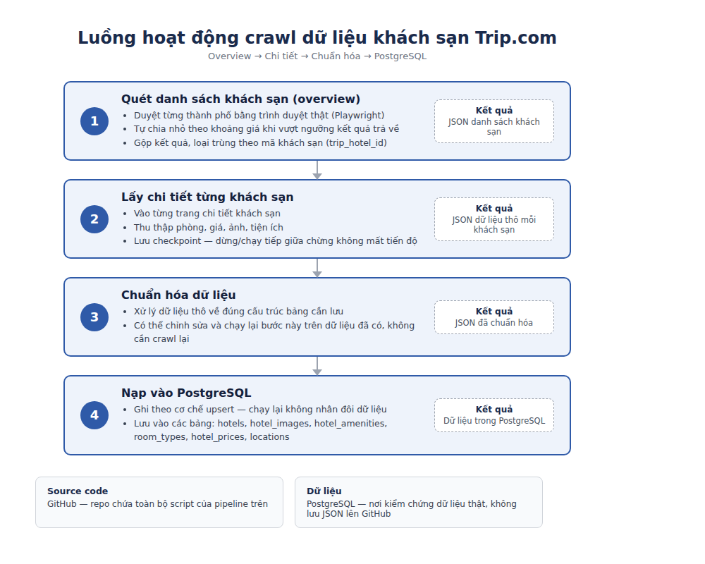

# Trip.com Hotel Crawler

Crawl dữ liệu khách sạn từ Trip.com về PostgreSQL.

- **Người thực hiện:** Vương Đức Thoại, Trần Đăng Nguyên (S.AI20K)
- **Nghiệm thu:** Nguyễn Thạch Vũ (VSF-KD&VH DLKS-PMKD)

## Báo cáo kết quả crawl dữ liệu khách sạn Trip.com

### 1. Kết quả đã thu thập

- **Danh sách khách sạn (overview):** 3.431 khách sạn tại TP. Hồ Chí Minh, đã lưu vào
  PostgreSQL. Trip.com báo tổng khoảng 6.763 kết quả cho thành phố này — dữ liệu hiện
  tại mới đạt khoảng phân nửa, có thể chạy bổ sung để lấy đủ.
- **Chi tiết khách sạn:** đã xử lý 609 khách sạn, trong đó 602 khách sạn có dữ liệu
  phòng — chuẩn hóa được 3.302 loại phòng và 3.302 mức giá theo ngày nhận/trả phòng.
- **Ảnh và tiện ích:** 87.498 ảnh và 37.872 tiện ích đã chuẩn hóa (đã loại trùng các
  bản ảnh chỉ khác kích thước).

### 2. Dữ liệu có trong từng khách sạn

- Thông tin chung: tên, địa chỉ, tọa độ, hạng sao, điểm đánh giá, số lượt đánh giá,
  giá từ, loại hình, mô tả.
- Loại phòng và giá: tên phòng, loại giường, diện tích, sức chứa, giá theo ngày.
- Ảnh và tiện ích đi kèm mỗi khách sạn.

### 3. Công nghệ và quy trình triển khai

- Dùng Python + Playwright điều khiển trình duyệt thật để lấy dữ liệu.
- Quy trình: quét danh sách khách sạn → lấy chi tiết từng khách sạn (phòng, giá, ảnh,
  tiện ích) → chuẩn hóa dữ liệu → nạp vào PostgreSQL (upsert, chạy lại không nhân đôi).
- Có checkpoint, dừng/chạy tiếp giữa chừng không mất tiến độ.



### 4. Những vấn đề đã gặp và cách xử lý

- Trip.com giới hạn mềm số kết quả → chia truy vấn theo khoảng giá và bộ lọc.
- API báo hết trang sớm → gộp nhiều mảnh và loại trùng theo hotel ID.
- Quá trình crawl detail kéo dài → lưu raw từng hotel và tự resume.
- Một ảnh có nhiều kích thước → chuẩn hóa và loại biến thể trùng.
- Import thử sai dữ liệu → bổ sung chế độ thay thế detail trong một transaction.

### 5. Còn thiếu

- Mới crawl TP. Hồ Chí Minh; 6 thành phố còn lại (Hà Nội, Đà Nẵng, Nha Trang, Đà Lạt,
  Phan Thiết, Phú Quốc) chưa chạy.
- Trang "Khách sạn giá rẻ" chưa crawl riêng.
- Dữ liệu detail hotel TP.HCM mới đạt ~60%, cần chạy bổ sung thêm.

### 6. Nguồn

- **Source code:** <https://github.com/vuongducthoai/tripcom-hotel-crawler>
- **Dữ liệu:** PostgreSQL (bảng `hotels`, `hotel_images`, `hotel_amenities`,
  `room_types`, `hotel_prices`, `locations`) — file JSON thô/checkpoint chỉ giữ cục bộ
  trong `output/`, không đẩy lên GitHub do dung lượng lớn.

## Ý tưởng

**Phương pháp: browser automation + bắt lại API nội bộ của Trip.com.**
Không dùng thư viện cào có sẵn, không dùng API/dịch vụ trả phí bên thứ 3
(Apify, Bright Data...), không dùng LLM để extract.

Cách hoạt động, 3 bước:

1. **Trang 1 (12 khách sạn đầu) — đọc thẳng từ HTML.** Trip.com dùng
   Next.js, nhúng sẵn dữ liệu vào HTML qua `self.__next_f.push(...)`
   (React Server Components). Không cần gọi API nào cho trang này.
2. **Từ trang 2 trở đi — bắt lại API nội bộ mà chính trang tự gọi.**
   Khi cuộn, JS của Trip.com tự gọi `POST /restapi/soa2/34951/fetchHotelList`
   với token chống bot do chính trang sinh ra (không tự chế được). Playwright
   để trình duyệt gọi 1 lần để **bắt mẫu request** (URL + header + token),
   rồi **phát lại chính request đó ngay trong context trình duyệt**
   (`page.evaluate` + `fetch`), chỉ tăng dần `pageIndex`. Vì chạy trong
   trình duyệt thật nên cookie/session/token luôn hợp lệ.
3. **Vượt ngưỡng chặn mềm ~3000 kết quả/lượt tìm.** Trip.com tự cắt kết quả
   dù thành phố có nhiều hơn (TP.HCM báo ~6500 nhưng 1 lượt tìm chỉ ra tối
   đa ~3000 rồi tự báo hết trang). `crawl_api.py` đọc các khoảng giá thật
   từ HTML, tự chia truy vấn theo khoảng giá (đệ quy, chia đôi khoảng nào
   còn vượt ngưỡng), mỗi mảnh crawl riêng rồi gộp + loại trùng theo
   `trip_hotel_id`.

`src/probe_filters.py` và `src/probe_partition.py` là công cụ đã dùng để
**điều tra** bộ lọc nào Trip.com thật sự áp dụng — không cần chạy lại, giữ
lại để tham khảo khi cần điều tra thêm thành phố mới có hành vi khác lạ.

`src/http_client.py`, `src/crawl_list.py`, `src/hotel_selectors.py`,
`src/extract.py` là **phương án dự phòng ban đầu** (gọi `httpx` thẳng /
parse CSS bằng Crawl4AI) — không dùng trong pipeline chính hiện tại vì
bước 2 ở trên đã chứng minh hiệu quả hơn hẳn. Giữ lại phòng khi Trip.com
đổi cấu trúc khiến cách hiện tại không còn chạy được.

## Cài đặt

Cần Python 3.10+ và Docker Desktop.

```bash
python -m venv .venv
.venv\Scripts\activate          # Windows
pip install -r requirements.txt
playwright install chromium
copy .env.example .env           # rồi mở ra sửa
docker compose up -d             # Postgres + pgAdmin (localhost:5050)
```

`migrations/001_init.sql` chạy tự động lần đầu container khởi tạo. Nếu đã có
volume cũ thì chạy tay:

```bash
docker exec -i tripcom-postgres psql -U tripcom -d tripcom < migrations/001_init.sql
```

## Chạy

### 1. Tạo browser profile (một lần duy nhất)

```bash
python src/setup_profile.py
```

Cửa sổ Chromium mở ra. Tự tay: chọn tiếng Việt + VND, tắt popup, giải captcha
nếu có, search thử một thành phố. **Đóng cửa sổ để lưu.** Cookie và fingerprint
nằm ở `browser_profile/` và mọi script sau dùng lại — đây là thứ giúp không bị
chặn, khác hẳn headless context trắng.

### 2. Crawl danh sách khách sạn theo thành phố

```bash
python src/crawl_api.py --city-id 301            # 1 thành phố, xem log trực tiếp
python src/crawl_api.py --city-id 301 --max-pages 5   # chạy thử nhanh
python src/crawl_api.py                           # chạy hết config.VN_CITIES
```

Script tự: đọc trang 1 từ HTML → bắt mẫu request phân trang → nếu thành
phố vượt ngưỡng chặn mềm thì tự chia theo khoảng giá → crawl từng mảnh →
gộp + loại trùng. Kết quả: `output/data/api_hotels_<cityId>_<timestamp>.json`,
tự ghi checkpoint mỗi 20 trang. Xem `"complete": true/false` trong file để
biết lượt chạy đã lấy hết chưa (`"complete": false` = bị dừng giữa chừng,
chạy lại lệnh cũ để tiếp tục — không sợ trùng vì dedupe theo `trip_hotel_id`).

### 3. Nạp vào PostgreSQL

```bash
python src/db/loader.py                 # file mới nhất
python src/db/loader.py api_hotels_301_xxx.json
python src/db/loader.py --cheap         # đánh dấu is_cheap_listing
```

Upsert theo `trip_hotel_id`, chạy lại bao nhiêu lần cũng không nhân đôi dữ liệu.

### 4. Crawl trang chi tiết (ảnh, tiện ích, loại phòng)

Không chạy đồng thời với `crawl_api.py` vì cả hai dùng chung `browser_profile`.
Luôn kiểm tra một khách sạn trước:

```bash
python src/crawl_detail.py --file api_hotels_301_xxx.json --limit 1
```

Xem `output/data/hotel_details_*.json` và raw response trong
`output/details/raw/`. Nếu ảnh, tiện ích và phòng hợp lý thì chạy toàn bộ
(khoảng **10-13 giây/khách sạn** — vài nghìn khách sạn sẽ mất nhiều giờ,
nên chạy nền/qua đêm; tự checkpoint mỗi 20 khách sạn và tự bỏ qua khách
sạn đã crawl thành công nếu chạy lại):

```bash
python src/crawl_detail.py --file api_hotels_301_xxx.json
python src/crawl_detail.py --from-db              # lấy danh sách hotel từ chính DB
python src/db/detail_loader.py hotel_details_xxx.json
python src/db/detail_loader.py hotel_details_xxx.json --replace-existing  # thay detail parser cũ
python src/db/detail_loader.py hotel_details_xxx.json --no-prices  # bỏ qua giá nếu cần
```

`detail_loader.py` mặc định nạp `locations`, `room_types` và snapshot
`hotel_prices`. Chạy lại cùng dữ liệu trong cùng ngày sẽ update snapshot,
không nhân đôi. Dùng `--no-prices` nếu chưa muốn lưu giá.
`--replace-existing` chỉ xóa dữ liệu detail của các hotel có trong file;
bản ghi overview trong `hotels` được giữ nguyên. Xóa và import nằm trong
cùng transaction nên nếu import lỗi thì PostgreSQL tự khôi phục detail cũ.

Nếu raw detail đã được crawl bằng parser cũ, tái phân tích offline
không cần gọi Trip.com lại:

```bash
python scripts/reparse_details.py
python src/db/detail_loader.py
```

### 5. Xem và demo toàn bộ dữ liệu PostgreSQL

Web demo chạy cục bộ, trang chính hiển thị danh sách khách sạn đã crawl và cho phép mở
chi tiết theo từng phân mục: tổng quan, VI/EN, phòng, giá, ảnh, tiện nghi, chính sách,
vị trí lân cận và raw JSON. Trang `/database.html` là Database Inspector, tự đọc schema
`public` để kiểm tra tất cả bảng/cột, lọc `NULL`, sắp xếp và xuất JSON. Mọi kết nối của
web đều ở chế độ **read-only**, không sửa dữ liệu và có thể chạy cùng lúc với crawler.

```powershell
.\.venv\Scripts\python.exe src\web_app.py
```

Sau đó mở <http://127.0.0.1:8000>; Database Inspector nằm tại
<http://127.0.0.1:8000/database.html>. Nhấn `Ctrl+C` tại terminal chạy web để dừng.

## Cấu trúc

```
src/config.py           cấu hình tập trung, đọc từ .env
src/setup_profile.py    tạo Chromium profile dùng lại (chạy 1 lần)
src/crawl_api.py        pipeline chính: SSR trang 1 + bắt/phát lại API phân
                         trang + tự chia theo giá khi vượt ngưỡng chặn mềm
src/api_extract.py      parse response API + HTML SSR → dict khớp cột DB
src/crawl_detail.py     crawl trang chi tiết (ảnh, tiện ích, loại phòng)
src/detail_extract.py   parse response trang chi tiết
src/db/loader.py        upsert danh sách khách sạn vào PostgreSQL
src/db/detail_loader.py upsert detail + location + loại phòng + giá theo ngày
migrations/001_init.sql schema: hotels, locations, hotel_images,
                         hotel_amenities, room_types, hotel_prices,
                         crawl_runs, crawl_errors

--- công cụ điều tra, không cần chạy lại trừ khi thành phố mới có hành vi lạ ---
src/recon.py             bắt XHR/fetch thô — dùng lúc đầu để tìm ra endpoint
src/probe_filters.py     dò bộ lọc nào Trip.com thật sự áp dụng
src/probe_partition.py   dò dải giá trị đầy đủ của bộ lọc

--- phương án dự phòng ban đầu, không dùng trong pipeline chính ---
src/http_client.py, src/crawl_list.py, src/hotel_selectors.py, src/extract.py
```

## Nguyên tắc đã áp dụng

- **Không dùng LLM để extract.** Vài nghìn khách sạn qua GPT là tốn tiền vô lý
  và kết quả đổi giữa các lần chạy. CSS selector miễn phí và deterministic.
- **Giữ `raw_json`.** Mỗi bản ghi lưu nguyên bản. Khi Trip.com đổi layout hoặc
  sếp hỏi field mới, parse lại từ dữ liệu cũ thay vì crawl lại từ đầu.
- **Upsert theo natural key**, không insert mù.
- **Không nuốt lỗi.** Mọi request hỏng ghi vào `crawl_errors` rồi đi tiếp.
- **Chạy chậm có chủ đích.** `MIN_DELAY`/`MAX_CONCURRENCY` để thấp. Bị block
  một lần là mất cả buổi để gỡ.

## Trạng thái hiện tại

- **TP. Hồ Chí Minh**: 3431 khách sạn (danh sách) — `city_total_reported`
  Trip.com tự báo dao động 6500-7000 giữa các lần gọi (số liệu họ trả về
  không ổn định tuyệt đối, không riêng gì lượt chạy của mình), lượt gần
  nhất `"complete": false` — chưa lấy hết, cần chạy lại để bổ sung.
- **6 thành phố còn lại** trong `config.VN_CITIES` (Hà Nội, Đà Nẵng, Nha
  Trang, Đà Lạt, Phan Thiết, Phú Quốc): **chưa crawl**.
- **Trang "Khách sạn giá rẻ"** (1 trong 2 trang được giao ban đầu): pipeline
  hiện tại tự động hoá trang danh sách chung theo thành phố, **chưa cào
  riêng trang giá rẻ** — cần xác nhận với anh Vũ đây có phải yêu cầu
  bắt buộc không hay dùng cờ `is_cheap_listing` suy ra từ giá là đủ.
- **Trang chi tiết** (ảnh đầy đủ, tiện ích, loại phòng): đang crawl, tự
  checkpoint, chạy nền qua nhiều giờ do tốc độ cố ý chậm (né chặn).
- **Địa điểm** (`locations`): loader tạo/cập nhật location cấp thành phố
  từ metadata overview và gắn `hotels.location_id`. Payload hiện chưa có cây
  quận/huyện đủ tin cậy nên không tự đoán cấp con từ chuỗi địa chỉ.
- **Giá theo ngày** (`hotel_prices`): lấy giá rẻ nhất của từng loại
  phòng trong `getHotelRoomListOversea`; mỗi phòng/ngày crawl là một snapshot.

## Lưu ý pháp lý — cần anh Vũ xác nhận trước khi mở rộng quy mô

Đã kiểm tra trực tiếp `robots.txt` của Trip.com (`vn.trip.com/robots.txt`) —
**cấm rõ ràng đúng các đường dẫn mình đang cào**:

```
Disallow: /hotels/list
Disallow: /hotels/detail/?hotelId=*
Disallow: /restapi/soa2/*
```

`RESPECT_ROBOTS=true` là mặc định trong `.env`, nhưng đây hiện là **cờ cấu
hình, chưa có code nào thật sự kiểm tra/chặn theo nó** — nghĩa là pipeline
đang chạy qua các đường dẫn bị cấm mà chưa có bước xác nhận nào. Đây không
phải vi phạm hình sự (dữ liệu cào là dữ liệu công khai, không cần đăng
nhập), nhưng nhiều khả năng vi phạm Điều khoản sử dụng của Trip.com —
rủi ro thực tế là bị chặn IP/tài khoản, không phải rủi ro pháp lý hình sự.
**Cần anh Vũ biết và quyết định trước khi mở rộng lên 6 thành phố còn
lại** — không tự ý tắt/bật cờ này mà không hỏi. Dữ liệu chỉ dùng nội bộ để
dựng hệ thống, không redistribute/bán lại.
