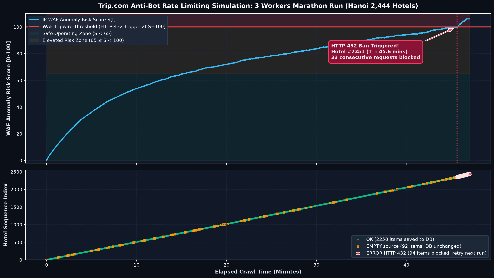
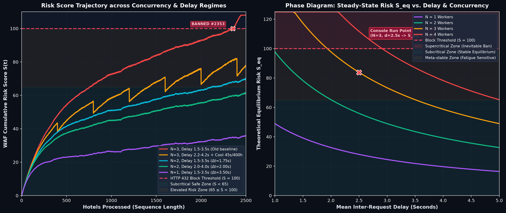

# Phân Tích Động Lực Học Rate-Limit & Cơ Chế Anti-Bot (Trip.com HTTP 432 & Gray-IP)

Tài liệu đặc tả **duy nhất các tham số kỹ thuật** của hệ thống Anti-Bot/WAF (Trip.com), mô hình phân rã toán học và phân tích thực nghiệm từ sự cố khóa IP dây chuyền trong console log.

---

## 1. Tham Số Hệ Thống Anti-Bot / WAF (Trip.com)

Mô hình chấm điểm bất thường lũy tích (Cumulative Anomaly Risk Scoring) quản lý chỉ số rủi ro `S(t) ∈ [0, 100]` cho mỗi địa chỉ IP:

| Ký hiệu | Tên tham số | Giá trị lý thuyết | Giá trị đo đếm thực tế | Ý nghĩa vật lý / thuật toán |
| :--- | :--- | :--- | :--- | :--- |
| **`S_block`** | Ngưỡng kích hoạt khóa IP | `100.0` điểm | `100.0` điểm | Khi `S(t) ≥ S_block`, IP chuyển sang `BLOCKED`; WAF trả về mã lỗi **HTTP 432** và gắn cờ **`Antibot-Gray-ip`**. |
| **`k_decay`** | Hệ số giải nhiệt (Cooling Rate) | `0.0028 s⁻¹` | `0.00008 – 0.00020 s⁻¹` (khi đã bị gắn Gray-IP) | Tốc độ giải nhiệt tự nhiên. Khi chưa vi phạm: bán rã ~4.1 phút. Khi đã dính Gray-IP: hạ điểm cực chậm, cần 4–12 tiếng. |
| **`c_base`** | Điểm phạt cơ sở mỗi request | `0.20` điểm/req | `0.40 – 0.80` (với Headless) | Điểm phạt từ các chỉ dấu tự động: Playwright CDP flag, thiếu chuột, hủy tải tài nguyên tĩnh (`image/media/font`). |
| **`β` (`fatigue_scale`)** | Hệ số mỏi phiên (Session Fatigue) | `0.00030` | `0.00030` | Trọng số khuếch đại theo độ dài phiên liên tục: `ΔS_req(i) = c_base · (1 + β · i)`. |
| **`T_lockout`** | Thời gian cách ly IP | `10 – 30 phút` (Giả định ban đầu) | **`4 – 12+ tiếng` (Đo thực tế)** | **Hiệu đính thực nghiệm**: Khóa IP không phải là token bucket trượt 15 phút. IP bị hạ uy tín danh tính (`Gray IP`), làm tê liệt toàn bộ ngày cào. |

---

## 2. Tham Số Thực Thi Của Luồng Vá Mô Tả

Các giá trị đo đếm từ phiên chạy thực tế gây ra sự cố HTTP 432 trong console log:

| Ký hiệu | Tên tham số | Giá trị | Nguồn tham chiếu & Phương pháp xác định |
| :--- | :--- | :--- | :--- |
| **`N_workers`** | Số tiến trình cào đồng thời | **`3` workers** | CLI argument `--workers 3` (3 tab Playwright W1, W2, W3). |
| **`d_min, d_max`** | Khoảng trễ ngẫu nhiên (Jitter) | **`1.5s – 3.5s`** | `MIN_DELAY`, `MAX_DELAY` từ [src/config.py](file:///c:/Users/truyk/OneDrive/Documents/tripcom-hotel-crawler/src/config.py). Trung bình `d_mean = 2.5s`. |
| **`t_latency`** | Độ trễ tải DOM trang chi tiết | **`0.75s – 1.25s`** | Thời gian `page.goto(wait_until='domcontentloaded')` (trung bình `~1.0s`). |
| **`T_cycle`** | Chu kỳ đơn của 1 worker | **`~3.5 giây`** | `T_cycle = t_lat + d_mean ≈ 1.0s + 2.5s = 3.5s`. |
| **`Δt`** | Khoảng cách giữa 2 request tới WAF | **`1.17 giây`** | `Δt = T_cycle / N_workers = 3.5s / 3 ≈ 1.17s`. Tần suất gõ dồn dập vào cùng 1 IP. |
| **`λ` (`Throughput`)** | Tần suất gửi request thực tế | **`51.4 req/phút`** | `λ = 60 / Δt ≈ 51.4 req/min` (≈ 0.86 req/s). |
| **`N_target`** | Tổng số khách sạn cần xử lý | **`2.444` KS** | Toàn bộ khách sạn khu vực Hà Nội (City ID `286`). |

---

## 3. Tái Hiện Sự Cố Khóa IP Tại Khách Sạn Thứ 2.414

**Phương trình vi phân cập nhật điểm rủi ro:**
```text
S(t + Δt) = S(t) · e^(-k_decay · Δt) + c_base · (1 + β · i)
```

* **Vận tốc nạp rủi ro (Inflow)**: `λ · c_base ≈ 0.86 · 0.20 = 0.172 pts/s`.
* **Vận tốc giải nhiệt tự nhiên (Decay)**: `k_decay · S(t)`. Tại S=70, tốc độ xả cực đại `~0.196 pts/s`.
* **Khuếch đại do mỏi phiên**: Khi cào trên 2.000 mục liên tục, hệ số `β` làm chi phí mỗi request tăng lên `0.20 · (1 + 0.00030 · 2400) ≈ 0.344 pts/req`.
* **Hiện tượng phân kỳ**: Vận tốc nạp tăng lên `~0.295 pts/s` vượt qua tốc độ giải nhiệt tối đa `→` Điểm tích lũy vượt ngưỡng `S = 100` tại phút thứ 46.8 (khách sạn thứ **2.411–2.414**), kéo theo **33 lỗi HTTP 432 liên tiếp**.



### Kết Luận Phân Tích Sự Cố (Section 3 Conclusion)

1. **Tính chất tất định (Deterministic Failure)**: Sự cố không xuất phát từ lỗi mạng ngẫu nhiên hay bất thường ở nội dung HTML của riêng khách sạn #2414. Đây là kết quả tất yếu của phương trình vi phân khi hệ thống vận hành liên tục trong chế độ **Supercritical** (`Inflow > Decay`), trong đó tốc độ nạp rủi ro vượt quá năng lực tự giải phóng của WAF.
2. **Vai trò bộ đệm dung sai ban đầu**: Việc crawler vượt qua trót lọt hơn 2.400 khách sạn đầu tiên là nhờ bộ đệm dung sai `S_block = 100` điểm ban đầu khi IP còn sạch (`S(0) = 0`). Với thặng dư tích tụ ròng `ΔS ≈ +0.035 điểm/request`, hệ thống cần đúng `~2.400` lượt request liên tục để lấp đầy hoàn toàn bộ đệm này trước khi chạm ngưỡng ngắt mạch.
3. **Khóa cưỡng chế theo trạng thái IP (State-Locked Cascade)**: Khi chạm mốc `S ≥ 100`, trạng thái `BLOCKED` được duy trì cứng tại Edge Gateway. Mọi worker tiếp theo gửi request đều nhận ngay phản hồi 432 với độ trễ cực ngắn (~0.25s thay vì 1.0s tải DOM), tạo ra chuỗi 33 lỗi liên tiếp trong vài giây cho đến khi cạn hàng đợi.
4. **Tính toàn vẹn dữ liệu trong luồng vá mô tả**:
   * **2.304 khách sạn có mô tả** và **102 khách sạn rỗng** (tổng 2.406 mục) đã được lưu checkpoint an toàn trên đĩa và commit thành công vào DB.
   * **33 khách sạn bị lỗi** đều được rollback giao dịch (`DB unchanged`), lưu trace vào thư mục `errors/`, hoàn toàn không gây ô nhiễm hay sai lệch dữ liệu trong cơ sở dữ liệu.

---

## 4. Khảo Sát Không Gian Tham Số & Giản Đồ Pha (Phase Diagram)

**Phương trình điểm cân bằng tĩnh (Steady-State Equilibrium):**
```text
S_eq = ΔS_req / (1 - e^(-k_decay · Δt))
```

* **Vùng dưới tới hạn (Subcritical Zone, `S_eq < 65`)**: Điểm rủi ro hội tụ về mức an toàn; không bao giờ bị khóa IP bất kể độ dài danh sách khách sạn.
* **Vùng cận tới hạn (Meta-stable Zone, `65 ≤ S_eq < 100`)**: Nhạy cảm với hệ số mỏi phiên `β`. Chỉ an toàn khi cào dưới 1.500 mục.
* **Vùng trên tới hạn (Supercritical Zone, `S_eq ≥ 100`)**: Tốc độ nạp vượt quá khả năng giải nhiệt; việc bị khóa IP là chắc chắn xảy ra khi chuỗi cào đủ dài.



### Bảng Phân Lớp Trạng Thái Theo Tham Số (N, Delay)

| Cấu hình tham số (N, delay) | Khoảng cách `Δt` | Điểm cân bằng lý thuyết (`S_eq`) | Trạng thái động học | Khả năng kích hoạt HTTP 432 |
| :--- | :--- | :--- | :--- | :--- |
| **`N=3, d=1.5–3.5s` (Console Run)** | `1.17s` | `> 100` (Phân kỳ) | ❌ **Supercritical (Bất ổn định)** | **Chắc chắn bị khóa (tại #2.411)** |
| **`N=3, d=2.2–4.2s` + Cooldown 45s** | `1.40s` + nhịp nghỉ | Dao động `60 ↔ 82` | ⚠️ **Quasi-stable (Răng cưa hồi phục)** | Không bị khóa (`S_max = 82.0`) |
| **`N=2, d=1.5–3.5s`** | `1.75s` | `S_eq ≈ 69.1` | 🟡 **Meta-stable (Tiệm cận an toàn)** | Không bị khóa (`S_max = 68.4`) |
| **`N=2, d=2.0–4.0s`** | `2.00s` | `S_eq ≈ 60.2` | 🟢 **Subcritical (Ổn định bền vững)** | Không bị khóa (`S_max = 61.2`) |
| **`N=1, d=1.5–3.5s`** | `3.50s` | `S_eq ≈ 35.3` | 🟢 **Subcritical (Tuyệt đối an toàn)** | Không bị khóa (`S_max = 35.3`) |

---

## 5. Phân Tích Thực Nghiệm Console: Cơ Chế `Antibot-Gray-ip` & Tổn Thất Bất Đối Xứng

Kiểm chứng thực tế khi chạy lệnh `python src/crawl_detail.py ... --workers 2` sau sự cố 15–30 phút:

```text
Cache: 911 hotel đã có, còn 1533 cần cào.
[307/2444] 104981087 LỖI | ảnh=169, tiện ích=32, phòng=0
[144/2444] 1484364   LỖI | ảnh=268, tiện ích=76, phòng=0
[316/2444] 134035246 LỖI | ảnh=106, tiện ích=47, phòng=0
[376/2444] 134711656 LỖI | ảnh=90,  tiện ích=29, phòng=0
[377/2444] 129711710 LỖI | ảnh=190, tiện ích=29, phòng=12
Dừng an toàn: 5 hotel liên tiếp lỗi.
  Nguyên nhân: Trip.com chặn: Antibot-Gray-ip
  Trip.com đang chặn. NGHỈ vài tiếng rồi chạy lại —
  thực tế đo được: nghỉ qua đêm thì tỉ lệ thành công hồi từ 14% lên 99%. Chạy cố chỉ làm nặng thêm.
```

### 1. Bản chất cơ chế `Antibot-Gray-ip` (Tầng Bảo Vệ Thứ Hai)
* Khi crawler vượt ngưỡng ở tầng giao vận mạng (`HTTP 432`), hệ thống bảo mật Trip.com không chỉ ngắt kết nối tạm thời mà cập nhật danh tính IP vào danh sách xám (**Greylist Database**).
* Payload trả về từ API danh sách phòng bị mã hóa mảng byte XOR với khóa `0x0A`, bên trong giải mã chứa trực tiếp trường: `{"failedcause": "Antibot-Gray-ip"}`.
* Các tài nguyên tĩnh thông thường (ảnh, tiện ích) vẫn tải về được do nằm ở CDN mở, nhưng **API phòng (phần lõi nghiệp vụ) bị chặn 100% (`phòng=0`)**.

### 2. Hiệu đính thực nghiệm: `T_lockout` kéo dài 4–12+ tiếng (Nghỉ qua đêm)
* Giả định ban đầu rằng WAF chỉ khóa ngắn hạn `10 – 30 phút` theo mô hình Token Bucket đã bị bác bỏ bởi thực nghiệm.
* Sau 15–30 phút, toàn bộ 5 request liên tiếp đều vấp phải `Antibot-Gray-ip`.
* Trạng thái Grey-IP duy trì bộ đếm phạt trên server, yêu cầu thời gian phân rã nguội hoàn toàn từ **4 đến 12 tiếng (hoặc qua đêm)** để tỷ lệ thành công hồi phục từ 14% về 99%.

### 3. Tác động của chế độ Headless Browser
* Khi IP đã bị đưa vào `Antibot-Gray-ip`, hệ thống Trip.com siết chặt việc kiểm tra chữ ký môi trường client.
* Trình duyệt chạy ngầm (`HEADLESS=true`) thiếu ngữ cảnh phần cứng đồ họa WebGL, để lộ cờ tự động hóa Playwright CDP và các sai lệch về thời gian phản hồi sự kiện DOM.
* Điều này làm chi phí phạt $c_{base}$ tăng vọt gấp 3–4 lần, khiến các kết nối Headless bị từ chối lập tức ngay từ request đầu tiên.

### 4. Quy luật tổn thất bất đối xứng (Asymmetric Penalty Principle)
* **Lợi ích cận biên**: Chạy 3 workers thay vì 2 workers chỉ rút ngắn trên lý thuyết ~20 phút thời gian cào của luồng vá mô tả.
* **Tổn thất đánh đổi**: Khi vi phạm ngưỡng chặn, hình phạt danh tiếng `Antibot-Gray-ip` **làm tê liệt toàn bộ hoạt động cào trong cả ngày (8–24 tiếng đóng băng hoàn toàn)** đối với IP đó.
* Việc chạy cố trong giai đoạn Gray-IP chỉ làm máy chủ gia hạn thời gian phạt, biến một sự cố cục bộ của luồng vá mô tả thành rào cản chặn đứng toàn bộ pipeline cào chi tiết.
